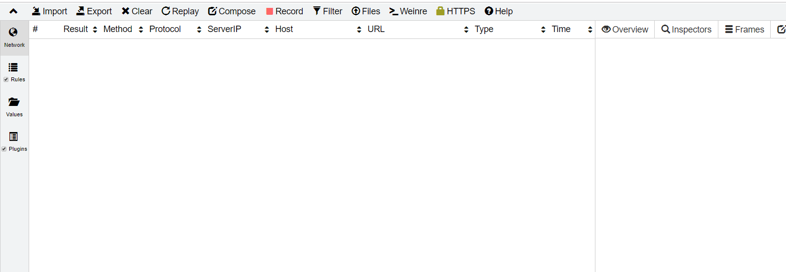
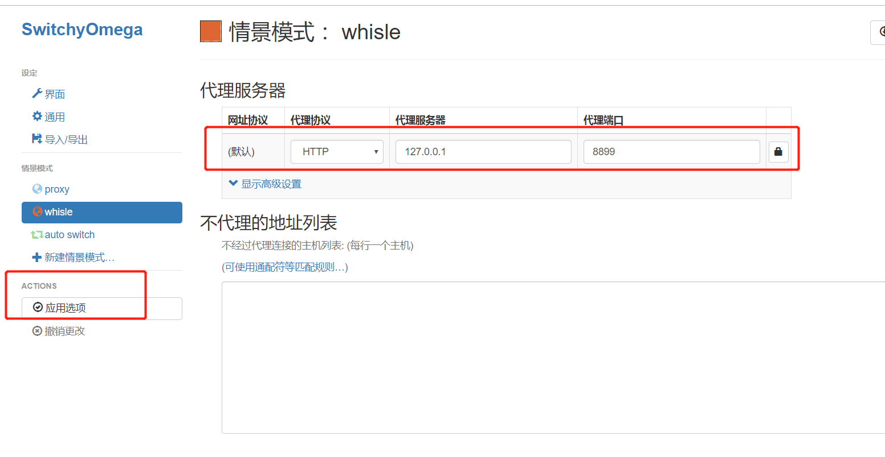
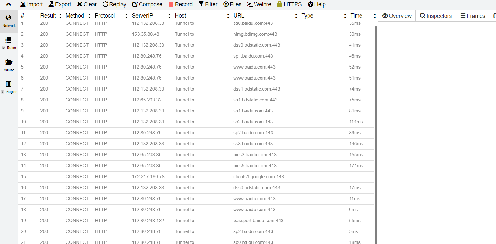
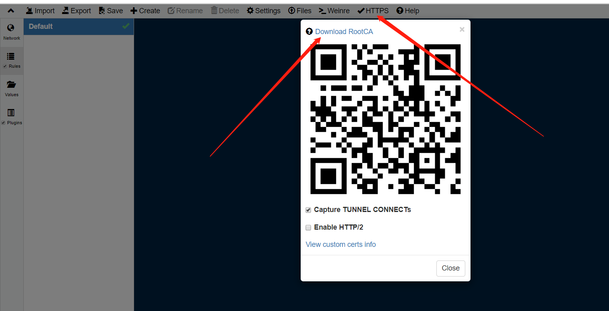
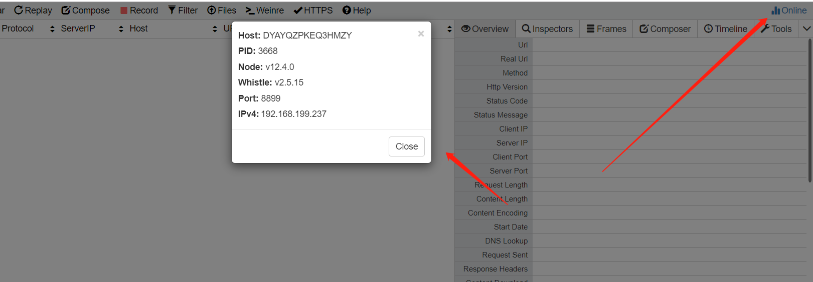

## whistle 前端调试神奇

[whistle  github](https://github.com/avwo/whistle/blob/master/README-zh_CN.md)

### 1. 业务场景

​		前端本地开发的场景中，线上项目添加新的功能或修复bug的时候，我们常用的方法是对线上文件或手机的页面进行抓包，然后使用本地的文件代替线上文件进行调试。

### 2. whistle	

​		之前使用的抓包工具是fiddler，其抓包和代理的功能十分强大，但在使用的过程中，有个很蛋疼的缺点就是内存泄漏！！fiddler挂一整天，内存就被吃完了，然后电脑变得巨卡无比，故使用起来感觉它”笨重“。现在同事的推荐下，使用了 whistle，发现它能替代fiddler完成我们日常的开发工作，而且使用起来很轻便。

### 3. 安装使用

#### 3.1 安装

```
 npm install  -g  whistle   //也可以使用cnpm
 
 w2 -h  //帮助信息
```

#### 3.2 启动

```
 w2 start  -p 8899  //不设置端口默认使用8899
```

启动完成后在chorme下打开 127.0.0.1:8899 可以看到这么一个页面：



但是现在还无法抓包，需要为浏览器设置代理。

###  3.3 为浏览器设置代理

[SwitchyOmega](https://github.com/FelisCatus/SwitchyOmega)

设置如下：



配置完成后，就可以抓包了。



如需抓取`https`包，安装`whistle `证书。



### 4. 基础功能

`Network`查看抓包，`rules`设置代理。

[基本功能](https://github.com/avwo/whistle/blob/master/README-zh_CN.md)

常用方式：

```
http:www.xx.com/xxx    D:\test\
http:www.xx.com/xxx    ip
```

将此`www.xx.com/`路径下的请求代理到本地 `D:test` 目录下或`ip`域名下

### 5. 真机调试

根据右上角的服务器地址和端口，在手机上配置代理后，即可抓取真机的包。



