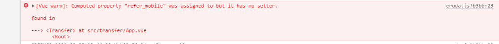

# v-model 绑定 Vuex State

```<component v-model="XXX">
computed: {
	...mapState({
		XXX: (state) => state.XXX,
	})
}
```

如上代码，组件中v-model=“XXX”，而XXX是vuex state中的某个变量，会报如下错误。



**原因**

​	vuex中是单项流，v-model是vue中的双向绑定，但是在computed中只通过get获取参数值，没有set无法改变参数值``

**解决方法**

```javascript
<component v-model="XXX">

computed: {
	XXX: {
    	get() {
    		return this.$store.state.xxx;
		},
        set(newVal) {
            this.$store.commit('updateStoreXXX', newVal);
        },
    }
}
```